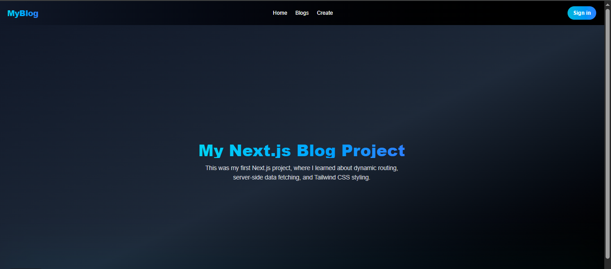
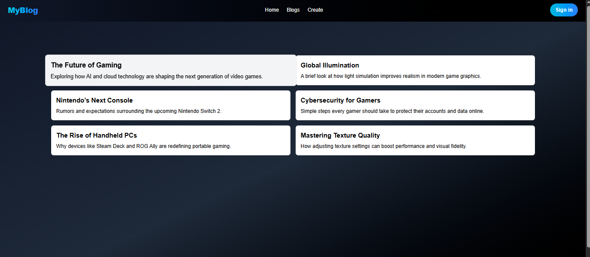
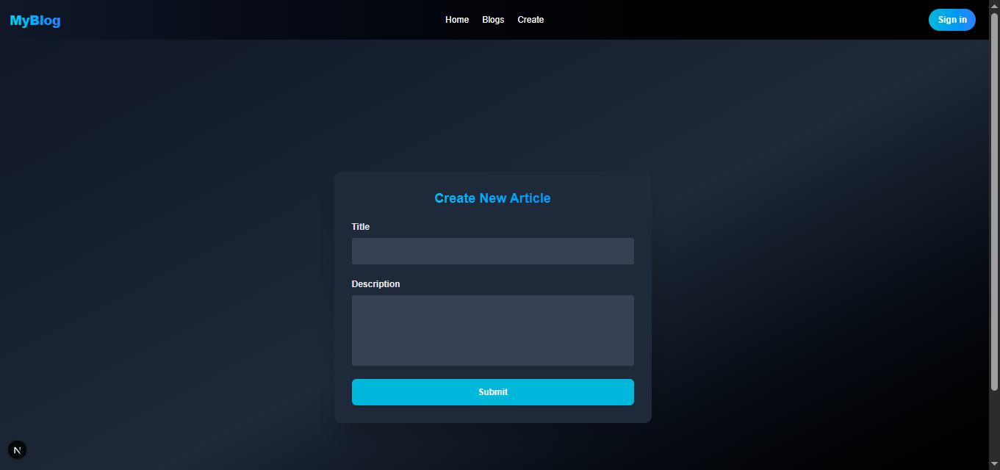
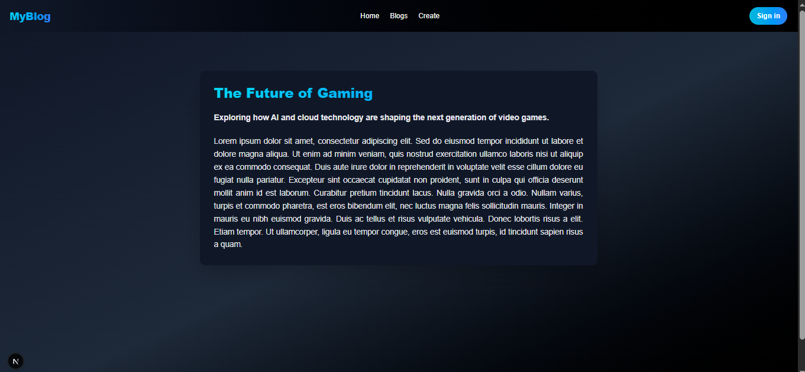

# 📰 My Next.js Blog Project

## 📖 About the Project
This is my **first project built with Next.js** — a simple blog application where users can:  
- ✍️ Create new articles  
- 📚 View all articles on the blog page  
- 🔍 Click on any article to see its full details  

The project uses **Tailwind CSS** for styling and **JSON Server** as a mock API for data handling.  

---
## 🖼️ Demo






## ⚙️ Technologies Used
- [Next.js 14](https://nextjs.org/)  
- [React](https://react.dev/)  
- [Tailwind CSS](https://tailwindcss.com/)  
- [JSON Server](https://github.com/typicode/json-server)  

---

## 🚀 How to Run the Project

### 1. Clone the Repository
```bash
git clone https://github.com/shakiba-vakili/Blog.git
cd Blog
```

### 2. Install Dependencies  
```bash
npm install
```

### 3. Start JSON Server  
In a separate terminal:
```bash
npx json-server --watch db.json --port 3001
```

### 4. Run the Development Server  
In the main terminal:
```bash
npm run dev
```

Then open your browser and go to:
```
http://localhost:3000
```

---

## 📂 Pages Structure
- `/blogs` → Shows the list of all articles  
- `/blogs/[id]` → Displays the full article details  
- `/create-blog` → Page to create a new article  

---

## 🌈 Features
✅ Add new articles with title and description  
✅ Fetch and post data using a local API (JSON Server)  
✅ Responsive design built with Tailwind CSS  
✅ Dynamic routing for detailed article pages  

---

## 💡 Personal Note
This was my **first Next.js project**, where I learned about **dynamic routing**, **server-side data fetching**, and **Tailwind CSS styling**.
